# MyLibrary

MyLibrary is a client-server application developed using various technologies:
* Java (Spring Boot for the server and Android for the client)
* PostgreSQL
* JSON Web Tokens
* Retrofit 2
* MPAndroidChart
* Google Maps

MyLibrary is dedicated to book enthusiasts and those looking to start reading, offering features to track books they've read, are currently reading, or plan to read, along with a variety of relevant statistics: like favorite genres, most read authors, distribution of readings by month, and preferences for book formats (physical, audiobook, e-book). The app also includes a book search system, allowing users to find books based on different criteria. Its interface has been designed to be intuitive, with easily accessible buttons, and the application is able to warn you if the data you enter is not consistent (e.g. the user cannot set a future date as the date they completed a book).

## Features
### Welcome/Login/Register

  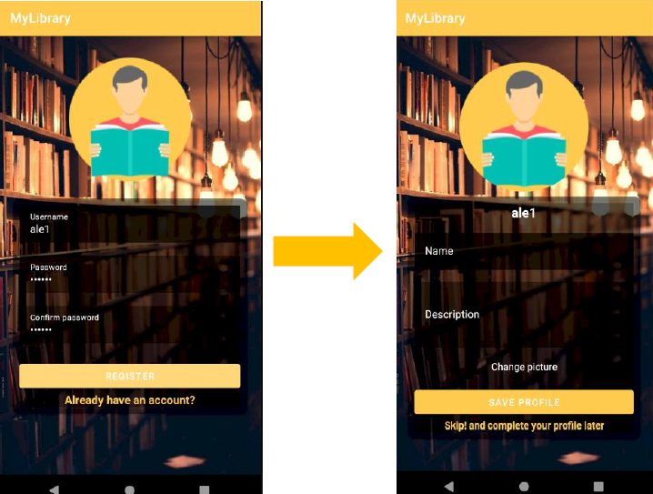

### Navigation menu

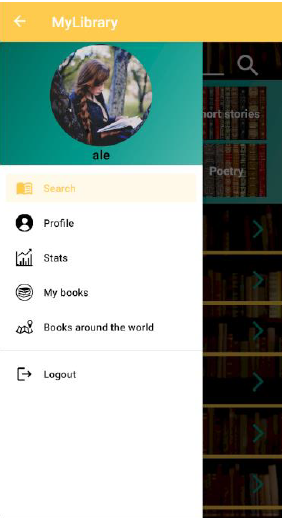

### Search books
* The user can search for books based on author, title, category, or genre.

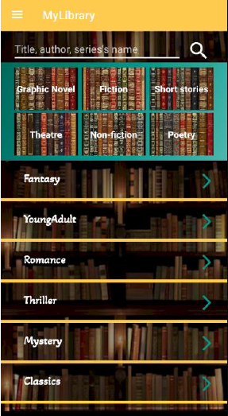 

* Presenting the book details: author, publication date, number of pages, synopsis, category, genre, other volumes in the series.

 

 * Presenting the author details

 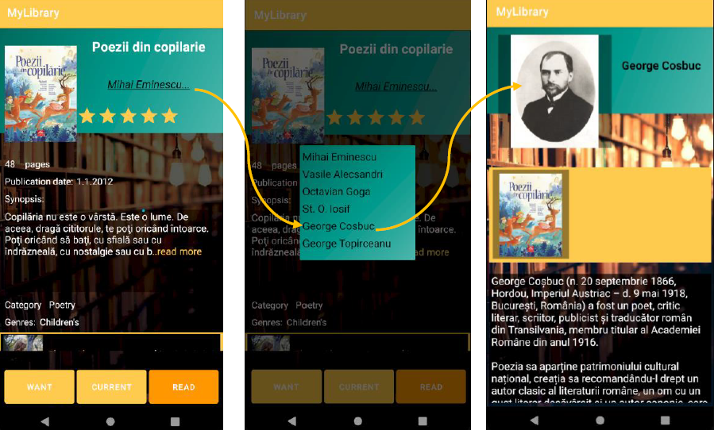

### Profile
* The user can change their profile: their photo and description.
  
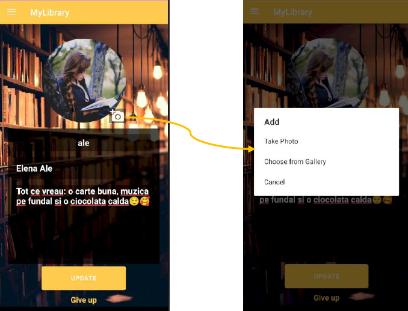

* The user can follow other users and see their profiles.

### Stats
Statistics are a significant part of the application, and they were the initial idea behind its development. The statistics are based on the books read by a user in a given year. Each statistics page features an EditText field for the year, which is automatically set to the current year. However, the user can change the year to view statistics from previous years.

* Number of books/pages read per year or by month.

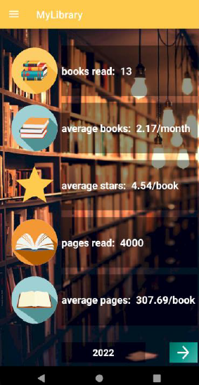 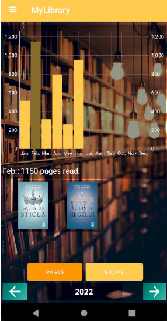

* Books classified by rating.

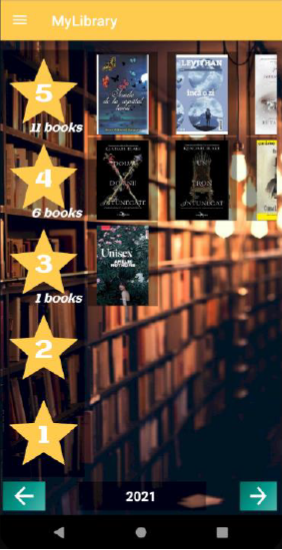

* Preferred author, genre, category and format.
  
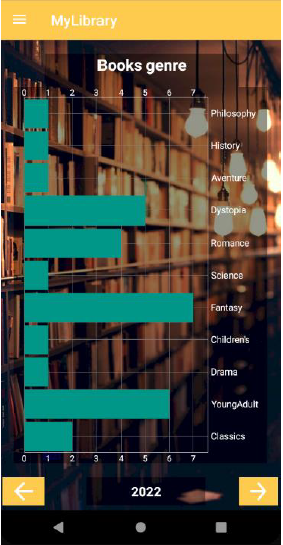 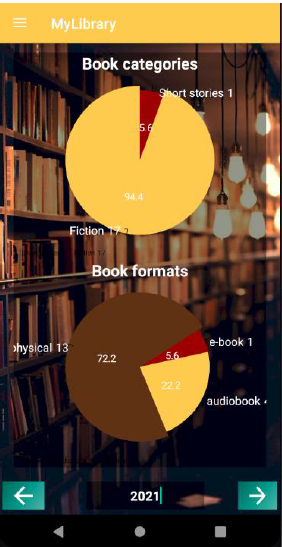 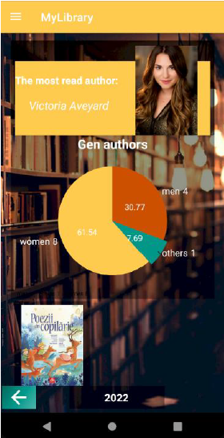

* Longest/shortest/fastest/slowest book read.

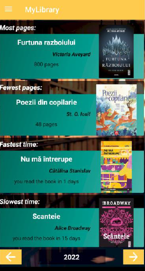

### My Books
* The user has three shelves: currently reading, want to read, and read.

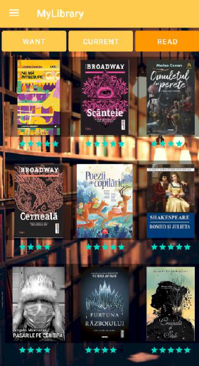

* Adding a book to the "Read" shelf by completing a reading log: the date you started, the date you finished reading, rating, the format in which you read it, and a review (optional).

### Map
* The user can see where they travel through the power of books.

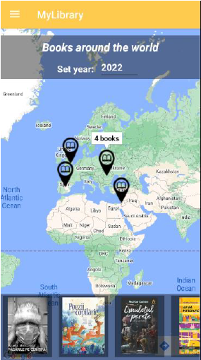

## Data Base
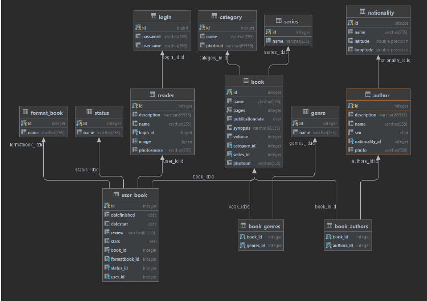

